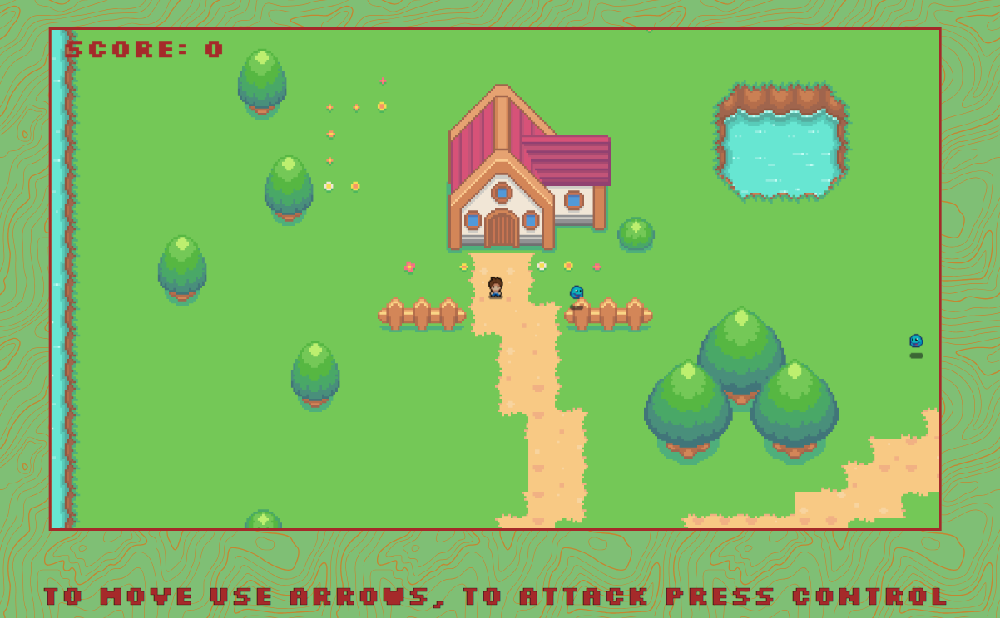

# Top-Down Game

This repository contains a top-down game created using JavaScript and HTML5 Canvas. The game provides a classic top-down perspective where the player controls a character to navigate through a maze-like environment, avoiding obstacles and enemies.

## Demo

A live demo of the Top-Down Game can be accessed [here](https://pawelslatwyezcky.github.io/topdowngame/).

## Gameplay

- Use the arrow keys (up, down, left, right) to move the character within the game world.
- Navigate through the maze-like environment while avoiding obstacles and enemies.
- Use Ctrl to attack.

## Features

- **Obstacles and Enemies:** Encounter various obstacles and enemies that add challenge and excitement to the gameplay.
- **Score and Progress Tracking:** Keep track of your score and progress as you advance through the game.
- **Responsive Controls:** The game controls are designed to be responsive and intuitive, providing a smooth gaming experience.

## Screenshots

## Getting Started

To get started with the Top-Down Game, follow these steps:

1. Clone the repository to your local machine using `git clone https://github.com/pawelslatwyezcky/topdowngame.git`.
2. Open the project in your preferred code editor.
3. Open the `index.html` file in a web browser to start playing the game.

## Technologies Used

- HTML5 Canvas
- JavaScript

## Contributing

Contributions to this project are welcome! If you have any suggestions, improvements, or find any issues, please feel free to submit a pull request.

## Acknowledgements

This Top-Down Game project was developed by Pash Slatwyezcky and draws inspiration from classic top-down adventure games.
